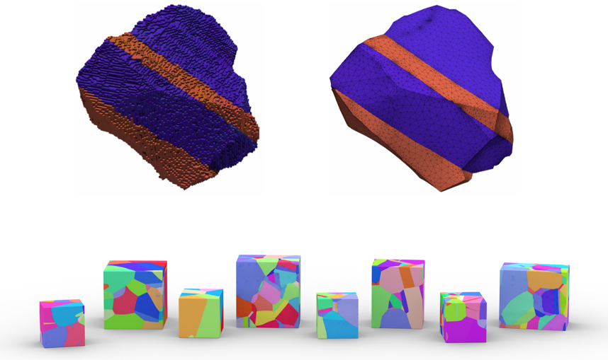

# XtalMesh - Tetrahedral Meshing of Polycrystals



XtalMesh ('crystal mesh') is an open-source code and containerized software suite used to generate tetrahedral finite-element mesh of polycrystals, and works well for both synthetic and experimental microstructures. The real value of XtalMesh lies in its ability to produce high-fidelity mesh representations of complex grain morphologies, particularly useful when studying local mechanical behavior near/at microstructural hetergoneities like grain boundaries and triple junctions. 

XtalMesh makes use of the powerful and robust tetrahedral meshing code [fTetWild](https://github.com/wildmeshing/fTetWild) as well as geometry processing libraries [PyMesh](https://github.com/PyMesh/PyMesh) and [libigl](https://github.com/libigl/libigl) with python bindings. This collection of software enables the design of customized meshing workflows in a simple python environment.

```bash
@article{Hestroffer2022,
author={Hestroffer, Jonathan M. and Beyerlein, Irene J.},
title={XtalMesh Toolkit: High-Fidelity Mesh Generation of Polycrystals},
journal={Integrating Materials and Manufacturing Innovation},
year={2022},
month={Mar},
day={01},
volume={11},
number={1},
pages={109-120},
issn={2193-9772},
doi={10.1007/s40192-022-00251-w},
url={https://doi.org/10.1007/s40192-022-00251-w}
}
```

## Installation

#### Pulling Docker Image (Recommended)

Install and run [Docker](https://docs.docker.com/), then within your command-line shell of choice, pull the XtalMesh Docker image.

```bash
docker pull jonathanhestroffer/xtalmesh
```

#### Building Image from Dockerfile

While not recommended, you can also choose to build XtalMesh from the Dockerfile provided. In a directory containing only the Dockerfile provided, run the following command:

```bash
docker build -t jonathanhestroffer/xtalmesh .
```

## Basic Usage

The following is a tutorial of XtalMesh using the example files provided in the [SyntheticTest](SyntheticTest) directory of this repository. Save these to your work directory.

#### Preparing Input

XtalMesh requires four ```.txt``` files and they include:

- nodes.txt
- nodetype.txt
- triangles.txt
- facelabels.txt

These must be generated for your 3D microstructure using [DREAM.3D](http://dream3d.bluequartz.net/). The ```.dream3d``` pipeline used to create these files as well as the files themselves used in this tutorial can be found in [SyntheticTest](SyntheticTest). Please note that grain/feature IDs equal to 0 will be treated as void material and will be removed after meshing.

#### Preparing Scripts

Along with the ```.txt``` files, you must also have these scripts in your work directory:

- xtal_smoother.py
- xtal_mesher.py
- tet_mesh_l2q.cpp
- tet_mesh_l2q.sh

#### Running Docker Container

The preferred method of running the Docker container is with the command ```docker run --rm -it -v <host-directory>:<container-directory> jonathanhestroffer/xtalmesh```.

Example:
```bash
docker run --rm -it -v F:/SyntheticTest/:/work jonathanhestroffer/xtalmesh
```

The above deploys a container with directory ```/work``` synced to the ```/SyntheticTest``` directory on the host machine, your work directory in this example. During execution of XtalMesh, all output files will be generated inside the host directory.

#### Smoothing

XtalMesh requires the execution of just two python scripts; the first performs Laplacian smoothing of the voxelated microstructure, and can be run from the host directory, where input files are stored, as ```python3 xtal_smoother.py <num-iters> <lambda>```

Example:
```
python3 xtal_smoother.py 20 1.0
```

Command Line Arguments:
```
<num-iters> INT               Number of Laplacian smoothing iterations
<lambda> FLOAT                Laplacian operator, λ > 0 (1.0 is a good default value)
```

Once smoothing is complete, all individual feature surface meshes will be written to ```/<host-directory>/GrainSTLs``` directory. These will then be stitched together to form ```Whole.stl```, available in host directory, used for subsequent volume meshing. Please note that the number of input vertices is preserved during surface smoothing. This means smoother grain boundaries and triple junctions can be achieved with higher resolution input microstructures. However, be wary of excessive input resolution as this will have a major impact on memory usage and runtime.

#### Meshing

After smoothing, to create volume mesh for the microstructure, run another python script from the host directory, where input files are stored, as ```python3 xtal_mesher.py <edge-length> <epsilon>```. This will run the [fTetWild](https://github.com/wildmeshing/fTetWild) meshing code.

Example:
```
python3 xtal_mesher.py 0.05 1e-3
```

Command Line Arguments:
```
<edge-length> FLOAT          Target element edge-length, ratio of the body diagonal (e.g., 0.05 = b/20               
<epsilon> FLOAT              Surface mesh deviation tolerance, ratio of the body diagonal (e.g., 1e-3 = b/1000)
```

Apart from the input microstructure size and resolution, values of ```<edge-length>``` and ```<epsilon>``` can largely affect RAM usage and runtime. Start with values of 0.05 and 1e-3 respectively and adjust as needed. If more RAM is required than what is allocated to the Docker container, then this process will be killed.

You can check CPU and RAM usage of the running container using:

```bash
docker stats
```

#### Output & Visualization

When meshing is complete, an ABAQUS ```.inp``` and VTK ```.vtk``` file are produced. The mesh can most easily be viewed by opening ```XtalMesh.vtk``` with [ParaView](https://www.paraview.org/).


## Using XtalMesh in HPC Cluster Environment (Without Docker)

In many cases, Docker is not available on many high performance computing (HPC) clusters due to security concerns. Luckily, secure HPC alternatives like [Singularity](https://sylabs.io) exist which are compatible with Docker images. Below is an example of how to setup XtalMesh using Singularity 3.5.2.

```bash
module load singularity/3.5.2
```
```bash
singularity pull docker://jonathanhestroffer/xtalmesh
```

The above commands will download the XtalMesh docker image and create a Singularity Image File (SIF) ```xtalmesh_latest.sif```. Users can then interact with this image file in a couple different ways.

#### Shell

One option is to spawn a new shell within your container and interact with it as though it were a small virtual machine. From there you can execute XtalMesh scripts as normal. Note that this is all done in your desired work directory.

```bash
singularity shell xtalmesh_latest.sif
```

#### Executing Commands

The second option is to execute a XtalMesh command within a container by specifying the image file.

```bash
singularity exec xtalmesh_latest.sif python3 xtal_smoother.py 20 1.0
```
```bash
singularity exec xtalmesh_latest.sif python3 xtal_mesher.py 0.05 1e-3
```
