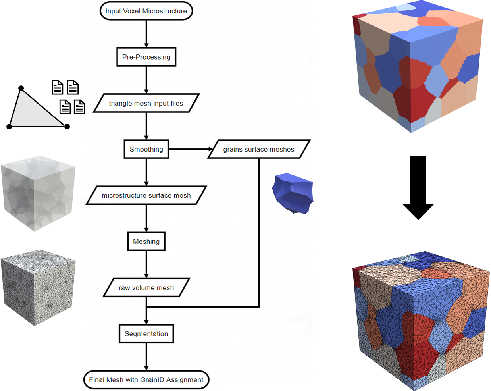

# XtalMesh : High-Fidelity Mesh Generation of Polycrystals



XtalMesh ('crystal mesh') is an open-source code and containerized software suite used to generate tetrahedral finite-element mesh of polycrystals, and works well for both synthetic and experimental microstructures. The real value of XtalMesh lies in its ability to produce high-fidelity mesh representations of complex grain morphologies, particularly useful when studying local mechanical behavior near/at microstructural hetergoneities like grain boundaries and triple junctions. 

XtalMesh makes use of the powerful and robust tetrahedral meshing code [fTetWild](https://github.com/wildmeshing/fTetWild) as well as geometry processing libraries [PyMesh](https://github.com/PyMesh/PyMesh) and [libigl](https://github.com/libigl/libigl) with python bindings. This collection of software enables the design of customized meshing workflows in a simple python environment.

```bash
@article{Hestroffer2022,
author={Hestroffer, Jonathan M. and Beyerlein, Irene J.},
title={XtalMesh Toolkit: High-Fidelity Mesh Generation of Polycrystals},
journal={Integrating Materials and Manufacturing Innovation},
year={2022},
month={Mar},
day={01},
volume={11},
number={1},
pages={109-120},
issn={2193-9772},
doi={10.1007/s40192-022-00251-w},
url={https://doi.org/10.1007/s40192-022-00251-w}
}
```

## Installation

### Pulling Docker Image (Recommended)

Install and run [Docker](https://docs.docker.com/), then within your command-line shell of choice, pull the XtalMesh Docker image.

```bash
docker pull jonathanhestroffer/xtalmesh
```

### Building Image from Dockerfile (Not Recommended)

While not recommended, you can also choose to build XtalMesh from the Dockerfile provided. In a directory containing only the Dockerfile provided, run the following command,

```bash
docker build -t jonathanhestroffer/xtalmesh .
```

## Basic Usage

The following is a tutorial of XtalMesh using the example microstructure data provided in the [SyntheticTest](SyntheticTest) directory of this repository.

### 1. Running the Docker Container

The preferred method of running the Docker container is with the command ```docker run --rm -it -v <host-directory>:<container-directory> jonathanhestroffer/xtalmesh```.

Example:
```bash
docker run --rm -it -v F:/SyntheticTest:/work jonathanhestroffer/xtalmesh
```

The example above deploys a Docker container with directory ```/work``` synced to my host directory ```F:/SyntheticTest``` on my host machine. All files located in ```/work```, mainly those generated during the execution of XtalMesh, will be available on the host machine in the host directory. Likewise, any files placed in the synced host directory will be available in the Docker container in ```/work```.

### 2. Preparing Input and Scripts

XtalMesh requires four ```.txt``` input files and they include:

- nodes.txt
- nodetype.txt
- triangles.txt
- facelabels.txt

These files describe the triangle geometry of your voxelized input data and must be generated for your 3D microstructure using [DREAM.3D](http://dream3d.bluequartz.net/). The ```.dream3d``` pipeline used to create these files as well as the files themselves used in this tutorial can be found in [SyntheticTest](SyntheticTest). Please note that grain/feature IDs equal to 0 will be treated as void material and will be removed after meshing.

XtalMesh requires these input files be located in the container directory you created, in this case ```/work```. When considering real usage of XtalMesh, these files would be prepared outside of Docker using DREAM.3D and copied over to the host directory. But for the purposes of this tutorial, inside the Docker container, we can simply copy those available to us in the ```/XtalMesh/SyntheticTest``` directory as,
```bash
cp /XtalMesh/SyntheticTest/*.txt /work
```

Along with the relevant ```.txt``` files, you must also have these scripts in your container work directory:

- xtal_smoother.py
- xtal_mesher.py

XtalMesh requires the execution of these two python scripts, one is for smoothing and the other meshing. Both scripts must be run from the container work directory. In this tutorial, inside the Docker container, we can simply copy them to ```/work``` as,
```bash
cp /XtalMesh/*.py /work
```

### 3. Smoothing

Inside the Docker container, move to the created container work directory, where all relevant input files and scripts have been located.
```bash
cd work
```
Once inside the correct directory, execute the ```xtal_smoother.py``` script. This script performs Laplacian smoothing of the voxelated microstructure with the following available command-line arguments.

Command Line Arguments:
```
Usage: python3 xtal_smoother.py [OPTIONS]
Options:
  -h,--help                   Print this help message and exit
  --num-iters INT             Number of Laplacian smoothing iterations (default: 20)
  --lamda FLOAT               Laplacian operator, λ > 0 (default: 1.0)
```

Once smoothing is complete, all individual feature/grain surface meshes will be written to ```/work/GrainSTLs``` directory inside the Docker container. These will then be stitched together to form ```Whole.stl```, available in ```/work```, used for subsequent volume meshing. Please note that the number of input vertices is preserved during surface smoothing. This means smoother grain boundaries and triple junctions can be achieved with higher resolution input microstructures. However, be wary of excessive input resolution as this will have a major impact on memory usage and runtime.

### 4. Meshing

After smoothing, to create volume mesh for the microstructure, run the ```xtal_mesher.py``` script from the same directory. This will run the [fTetWild](https://github.com/wildmeshing/fTetWild) meshing code with the following available command-line arguments.

Command Line Arguments:
```
Usage: python3 xtal_mesher.py [OPTIONS]
Options:
  -h,--help                   Print this help message and exit
  --edge-length FLOAT         Target element edge-length, ratio of the body diagonal (e.g., 5e-2 = b/20, default: 5e-2)               
  --epsilon FLOAT             Surface mesh deviation tolerance, ratio of the body diagonal (e.g., 1e-3 = b/1000, default: 1e-3)
  --order INT                 Element order, linear or quadratic (1 or 2) (default: 2)
```

Apart from the input microstructure size and resolution, values of ```edge-length``` and ```epsilon``` may greatly affect RAM usage and runtime. Start with the default values and adjust as needed. If more RAM is required than what is allocated to the Docker container, then this process will be killed and you will most likely see a Segmentation Fault error.

To check CPU and RAM usage of any running container, open another shell and enter the following command,

```bash
docker stats
```

### 5. Output & Visualization

When meshing is complete, an ABAQUS ```.inp``` and VTK ```.vtk``` file are produced. The mesh can most easily be viewed by opening ```XtalMesh.vtk``` with [ParaView](https://www.paraview.org/).


## Using XtalMesh in HPC Cluster Environment (Without Docker)

In many cases, Docker is not available on many high performance computing (HPC) clusters due to security concerns. Luckily, secure HPC alternatives like [Singularity](https://sylabs.io) exist which are compatible with Docker images. Below is an example of how to setup XtalMesh using Singularity 3.5.2.

```bash
module load singularity/3.5.2
```
```bash
singularity pull docker://jonathanhestroffer/xtalmesh
```

The above commands will download the XtalMesh docker image and create a Singularity Image File (SIF) ```xtalmesh_latest.sif```. Users can then interact with this image file in a couple different ways.

### 1. Shell

One option is to spawn a new shell within your container and interact with it as though it were a small virtual machine. From there you can execute XtalMesh scripts as normal. Note that this is all done in your desired work directory.

```bash
singularity shell xtalmesh_latest.sif
```

### 2. Executing Commands

The second option is to execute a XtalMesh command within a container by specifying the image file.

```bash
singularity exec xtalmesh_latest.sif python3 xtal_smoother.py
```
```bash
singularity exec xtalmesh_latest.sif python3 xtal_mesher.py
```
